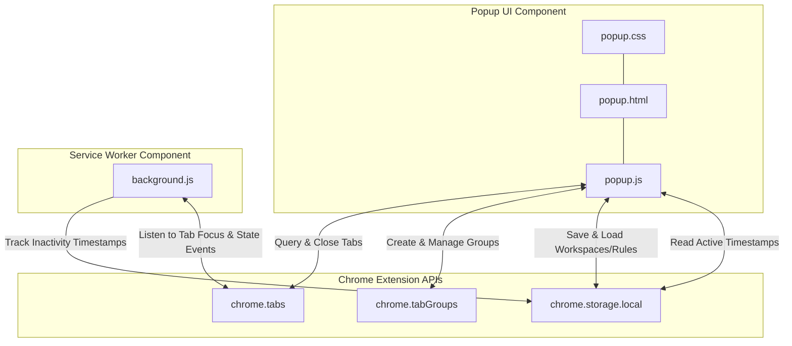

# Smart Tab Groups Chrome Extension

Smart Tab Groups is a premium, high-performance Manifest V3 Chrome extension designed to solve the "100+ open tabs" problem. It automatically groups tabs by topic, finds duplicate tabs, suggests stale tabs to close, and saves/restores custom workspaces.

The extension features a modern dark-theme glassmorphic design with smooth micro-animations.

---

## 🏗️ Architecture Diagram

Here is a visual representation of how the extension's components interact:

---

## 🚀 Features

1. **Auto-Grouping Engine (Offline Heuristics)**: Classifies and organizes tabs into colored groups based on domain mappings, paths, and title keywords. Ready for default categories (*Coding, Shopping, College & Research, YouTube & Media, Social & News*).
2. **Duplicate Finder**: Scan active tabs to locate duplicates of the same URL. Offers selective group cleanup or one-click bulk merge actions.
3. **Stale Tab suggestion**: Monitors background tab focus activity, and highlights tabs that have been idle past a custom inactivity threshold (e.g. 1 hour, 2 hours, 1 day) for optional closure.
4. **Workspace Manager**: Captures and persists the active state of all tabs and groups as a "Workspace". Restores the exact workspace structure on demand.
5. **Custom Rules Engine**: Configure personal rules mapping specific domains to targeted auto-groups.

---

## 🛠️ Installation & Setup

1. Open Google Chrome.
2. Navigate to `chrome://extensions/` in the address bar.
3. Enable the **Developer mode** toggle in the top-right corner.
4. Click the **Load unpacked** button in the top-left corner.
5. Select the folder: `/Users/aksharsakhi/Documents/Files/VScode/Chrome/smart_tab_groups`.
